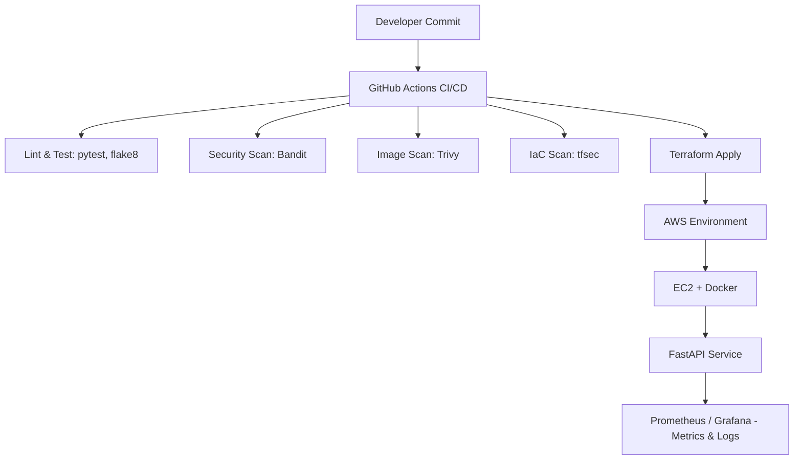

# 🚀 Secure CI/CD Demo – DevSecOps on AWS
[](https://github.com/Shyam7773/devsecops-secure-cicd-aws-terraform-fastapi/actions/workflows/ci.yml)

[](https://opensource.org/licenses/MIT)

**A fully automated DevSecOps pipeline showcasing secure software delivery using GitHub Actions, Terraform, Docker, FastAPI, and AWS.**

This project demonstrates how a modern engineering team can deliver **secure, observable, and reproducible infrastructure** — from code to cloud — while keeping automation, testing, and security checks at the heart of the workflow.

---

## 🌍 Overview

| Component | Technology | Purpose |
|------------|-------------|----------|
| Application | **FastAPI** | Lightweight REST API with `/predict`, `/health`, `/metrics` |
| Infrastructure | **Terraform (AWS)** | VPC, EC2, IAM, and security groups |
| Containerization | **Docker** | Non-root image, reproducible build |
| CI/CD | **GitHub Actions** | Automated linting, testing, scanning, and IaC validation |
| Security | **Bandit, Trivy, tfsec** | Multi-layer scanning for vulnerabilities and misconfigurations |
| Monitoring | **Prometheus / Grafana** | Observability via `/metrics` endpoint |

---

## 🧱 Architecture Diagram


---

## 🧰 Features

✅ **FastAPI Microservice** – `/health`, `/predict`, and `/metrics` endpoints  
✅ **Dockerized Deployment** – lightweight, non-root image  
✅ **GitHub Actions CI/CD** – automated linting, testing, security scanning  
✅ **Security by Default** – Bandit, Trivy, and tfsec integration  
✅ **Infrastructure as Code** – Terraform-managed AWS setup  
✅ **Observability Built-In** – Prometheus-compatible metrics  
✅ **Clean Documentation & Testing** – pytest, coverage, and reproducible results

---

## 📂 Repository Structure
```bash
secure-ci-cd-demo/
├── app/ # FastAPI application code
│ ├── main.py # Core app with /predict, /health, /metrics
│ └── requirements.txt # Dependencies
│
├── tests/ # Unit tests (pytest)
│ └── test_app.py
│
├── infra/ # Terraform IaC
│ ├── main.tf # AWS infra definition (VPC, EC2, IAM)
│ ├── variables.tf # Configurable parameters
│ ├── outputs.tf # Terraform outputs
│ └── user_data.sh # Bootstraps EC2 to run Docker container
│
├── .github/workflows/ # CI/CD automation
│ └── ci.yml # Full GitHub Actions pipeline
│
├── Dockerfile # Secure container build (non-root)
├── prometheus.yml # Prometheus scraping config
├── .gitignore # Ignore Python & Terraform temp files
├── .dockerignore # Optimize Docker context
└── README.md # This documentation
```

---
## ⚙️ Local Setup

### 1️⃣ Clone the repository
```bash
git clone https://github.com/Shyam7773/devsecops-secure-cicd-aws-terraform-fastapi.git
cd devsecops-secure-cicd-aws-terraform-fastapi
```

### 2️⃣ Build and run locally
```bash
docker build -t devsecops-demo:local .
docker run -p 8080:80 devsecops-demo:local
```
### 3️⃣ Test endpoints
```bash
curl http://localhost:8080/health
curl -X POST http://localhost:8080/predict -H "Content-Type: application/json" -d '{"text": "great work!"}'
curl http://localhost:8080/metrics
```

### 🧪 CI/CD Pipeline Overview
| Stage            | Tool      | Description                     |
| ---------------- | --------- | ------------------------------- |
| **Format**       | Black     | Ensures PEP8 formatting         |
| **Lint**         | Flake8    | Static analysis for Python code |
| **Test**         | Pytest    | Unit tests with coverage        |
| **Code Scan**    | Bandit    | Security scan for Python        |
| **Image Scan**   | Trivy     | CVE scan for Docker image       |
| **IaC Scan**     | tfsec     | Terraform security audit        |
| **Validate IaC** | Terraform | Syntax & policy validation      |

Every push or pull request triggers this workflow automatically.

### ☁️ Terraform Deployment (AWS)
Prerequisites

AWS CLI configured

Terraform >= 1.5.0 installed

IAM user/role with basic EC2 + VPC privileges

Steps
```bash
cd infra
terraform init -backend=false
terraform plan -var="container_image=nginxdemos/hello"
terraform apply -auto-approve -var="container_image=nginxdemos/hello"
```

### 🔒 Security Highlights
| Layer                      | Tool                 | What It Does                            |
| -------------------------- | -------------------- | --------------------------------------- |
| **Static Analysis**        | Bandit               | Detects insecure code patterns          |
| **Container Image**        | Trivy                | Scans OS packages and dependencies      |
| **Infrastructure as Code** | tfsec                | Flags insecure Terraform configurations |
| **Runtime**                | Non-root Docker user | Minimizes privilege escalation risk     |
| **Secrets Management**     | GitHub Secrets       | Keeps credentials out of code           |


### 📈 Monitoring & Observability

App exposes Prometheus metrics via /metrics

Default prometheus.yml scrapes every 15s:
```bash
scrape_configs:
  - job_name: 'fastapi-app'
    static_configs:
      - targets: ['<EC2_IP>:80']
```
Optional Grafana integration for dashboarding request counts and latency

### 📘 Example Output

GET /health
```bash
{"status": "healthy"}
```
POST /predict
```bash
{"prediction": 1}
```

### 🧩 Tools Used
| Category      | Tool                 |
| ------------- | -------------------- |
| Language      | Python 3.11          |
| Framework     | FastAPI              |
| Cloud         | AWS                  |
| IaC           | Terraform            |
| CI/CD         | GitHub Actions       |
| Security      | Bandit, Trivy, tfsec |
| Observability | Prometheus, Grafana  |
| Testing       | Pytest               |
| Linting       | Flake8, Black        |


### 🏆 Why This Project Matters

This repository demonstrates real-world DevSecOps excellence:

✅ Infrastructure as Code (Terraform)
✅ Secure CI/CD pipelines (GitHub Actions)
✅ Continuous Testing & Scanning
✅ Container Hardening
✅ Observability from Day One

It’s built to reflect Salesforce’s DevSecOps engineering philosophy — secure, scalable, and automated from commit to cloud.

## 🧠 Author

Shyam Pratap Singh Rathore
📍 Dublin, Ireland
🎓 MSc Data & Computational Science, University College Dublin
🔗 LinkedIn : https://www.linkedin.com/in/spsr2001
